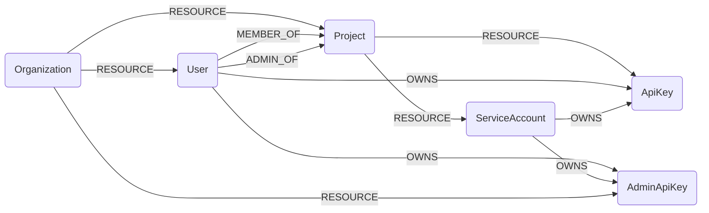

## OpenAI Schema




### OpenAIAdminApiKey

Represents an individual Admin API key in an org.

| Field | Description |
|-------|-------------|
| id | The identifier, which can be referenced in API endpoints |
| firstseen| Timestamp of when a sync job first created this node  |
| lastupdated |  Timestamp of the last time the node was updated |
| object | The object type, which is always `organization.admin_api_key` |
| name | The name of the API key |
| created_at | The Unix timestamp (in seconds) of when the API key was created |
| last_used_at | The Unix timestamp (in seconds) of when the API key was last used |


#### Relationships
- `Admin API Key` belongs to an `Organization`
    ```
    (OpenAIOrganization)-[:RESOURCE]->(OpenAIAdminApiKey)
    ```
- `Admin API Key` is owned by a `User` or a `ServiceAccount`
    ```
    (:OpenAIUser)-[:OWNS]->(:OpenAIAdminApiKey)
    (:OpenAIServiceAccount)-[:OWNS]->(:OpenAIAdminApiKey)
    ```

### OpenAIUser

Represents an individual `user` within an organization.

| Field | Description |
|-------|-------------|
| id | The identifier, which can be referenced in API endpoints |
| firstseen| Timestamp of when a sync job first created this node  |
| lastupdated |  Timestamp of the last time the node was updated |
| object | The object type, which is always `organization.user` |
| name | The name of the user |
| email | The email address of the user |
| role | `owner` or `reader` |
| added_at | The Unix timestamp (in seconds) of when the user was added. |

#### Relationships
- `User` belongs to an `Organization`
    ```
    (OpenAIOrganization)-[:RESOURCE]->(OpenAIAdminApiKey)
    ```
- `Admin API Key` is owned by a `User`
    ```
    (:OpenAIUser)-[:OWNS]->(:OpenAIAdminApiKey)
    ```
- `API Key` is owned by a `User`
    ```
    (:OpenAIUser)-[:OWNS]->(:OpenAIApiKey)
    ```
- `User` are member of a `Project`
    ```
    (:OpenAIUser)-[:MEMBER_OF]->(:OpenAIProject)
    ```
- `User` are admin of a `Project`
    ```
    (:OpenAIUser)-[:ADMIN_OF]->(:OpenAIProject)
    ```

### OpenAIProject

Represents an individual project.

| Field | Description |
|-------|-------------|
| id | The identifier, which can be referenced in API endpoints |
| firstseen| Timestamp of when a sync job first created this node  |
| lastupdated |  Timestamp of the last time the node was updated |
| object | The object type, which is always `organization.project` |
| name | The name of the project. This appears in reporting. |
| created_at | The Unix timestamp (in seconds) of when the project was created. |
| archived_at | The Unix timestamp (in seconds) of when the project was archived or `null`. |
| status | `active` or `archived` |

#### Relationships
-  `ServiceAccount` and `APIKey` belong to an `OpenAIProject`.
    ```
    (:OpenAIProject)<-[:RESOURCE]-(
        :OpenAIServiceAccount,
        :OpenAIApiKey,
    )
    ```
- `Project` belongs to an `Organization`
    ```
    (OpenAIOrganization)-[:RESOURCE]->(OpenAIProject)
    ```
- `User` are member of a `Project`
    ```
    (:OpenAIUser)-[:MEMBER_OF]->(:OpenAIProject)
    ```
- `User` are admin of a `Project`
    ```
    (:OpenAIUser)-[:ADMIN_OF]->(:OpenAIProject)
    ```

### OpenAIServiceAccount

Represents an individual service account in a project.

| Field | Description |
|-------|-------------|
| id | The identifier, which can be referenced in API endpoints |
| firstseen| Timestamp of when a sync job first created this node  |
| lastupdated |  Timestamp of the last time the node was updated |
| object | The object type, which is always `organization.project.service_account` |
| name | The name of the service account |
| role | `owner` or `member` |
| created_at | The Unix timestamp (in seconds) of when the service account was created |

#### Relationships
- `ServiceAccount` belongs to a `Project`
    ```
    (:OpenAIServiceAccount)-[:RESOURCE]->(:OpenAIProject)
    ```
- `Admin API Key` is owned by a `ServiceAccount`
    ```
    (:OpenAIServiceAccount)-[:OWNS]->(:OpenAIAdminApiKey)
    ```
- `API Key` is owned by a `ServiceAccount`
    ```
    (:OpenAIServiceAccount)-[:OWNS]->(:OpenAIApiKey)
    ```


### OpenAIApiKey

Represents an individual API key in a project.

| Field | Description |
|-------|-------------|
| id | The identifier, which can be referenced in API endpoints |
| firstseen| Timestamp of when a sync job first created this node  |
| lastupdated |  Timestamp of the last time the node was updated |
| object | The object type, which is always `organization.project.api_key` |
| name | The name of the API key |
| created_at | The Unix timestamp (in seconds) of when the API key was created |
| last_used_at | The Unix timestamp (in seconds) of when the API key was last used. |


#### Relationships
- `ApiKey` belongs to a `Project`
    ```
    (:OpenAIApiKey)-[:RESOURCE]->(:OpenAIProject)
    ```
- `APIKey` is owned by a `User` or a `ServiceAccount`
    ```
    (:OpenAIUser)-[:OWNS]->(:OpenAIApiKey)
    (:OpenAIServiceAccount)-[:OWNS]->(:OpenAIApiKey)
    ```
